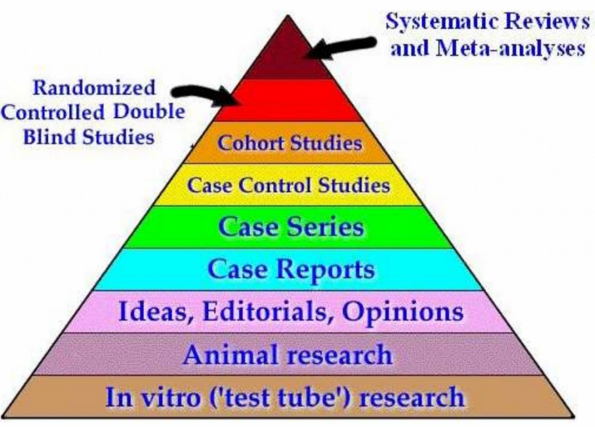
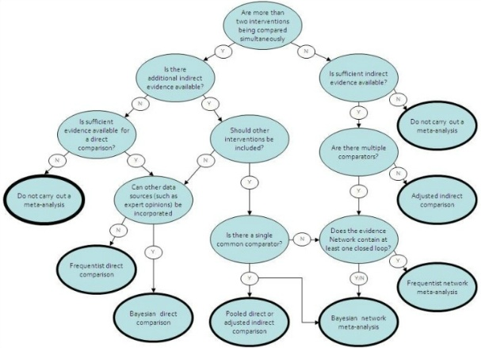
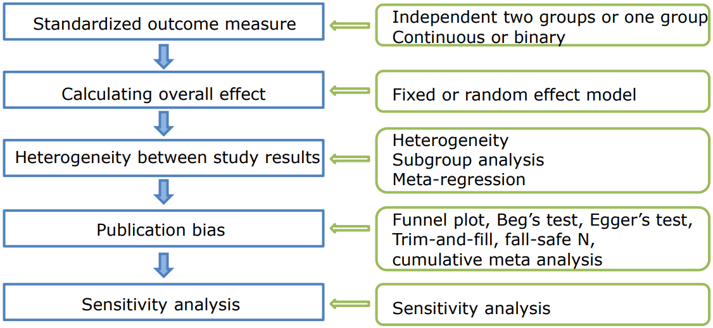

## Heirarchy of Evidence


## 경험과학적 자료를 분석하는 수준 (황정규(1998))
- 제1차 분석(primary analysis): 연구에서 얻은 원자료(original data)를 직접 분석
- 제2차분석(secondary analysis): 제1차 분석 자료를 재분석, 제1차분석의 연구문제에 대해 보다 나은 통계적 방법을 사용하거나 새로운 연구 질문에 대답을 구하려는 목적
- 메타분석(meta-analysis): 개별적 연구·결과들을 통계적으로 분석하는 이론 및 방법

## Introduction to meta-analysis
- 메타분석: 하나의 주제에 대해 연구한 여러 개별 선행연구들의 결과를 양적으로
통합하기 위해 사용하는 통계적 방법.
- 필요성:
 1. 개별 연구들의 연구결과가 일관성이 있는 경우 검정력이 높아지며, 증가 표본수로 인해 정밀도 증가
 2. 개별 연구들의 연구결과가 일관성이 없는 경우 연구결과에 영향을 주는 요인들을 파악 (예: Colditz et. al (1994) BCG 백신의 효과)
 3. 새로운 연구가 필요할 때, 연구설계에 도움
- 유의할 점:
 1. 개별 연구의 특성이 서로 이질적이어서 통합자체가 의미가 없는 경우
 2. 개별 연구 자체가 심각한 비뚤림(bias)을 가지고 있을 때
 3. 심각한 출판 비뚤림(publication bias)이 있는 경우
※ 아무리 훌륭한 메타분석도 연구의 질이 낮은 개별 연구의 한계점을 극복할 수 없다는 점

## Procedures of meta-analysis
1. 연구주제를 명확히 설정
2. 프로토콜 작성: 검색할 연구 특성(연구대상자, 결과변수 등), 검색방법, 연구들의 선정/제외기준 등 포함
3. 프로토콜 바탕으로 메타분석을 위한 연구들을 최종 선정하고, 필요한 자료 추출하여 정리
4. 선정된 연구들의 연구특성 및 연구방법 등을 고려하여 연구들이 동질하다고 판단이 되는 경우에 메타분석 수행함.


##  메타분석 방법의 선정 (출처 : Health Information and Quality Authority, 2011)


## 메타분석 결과해석에 포함되어야 할 사항
1. 메타분석에 포함된 개별연구의 수와 편의의 위험이 포함된 제시된 증거
2. 효과크기 수준 및 연구 수준의 효과에 대한 정확도에 대한 평가
3. 메타분석에 포함된 개별연구들이 동일 모집단에서 추출된 것인지에 대한 판단을 위해 연구간 효과들의 동질성 검정
4. 개별효과 크기들을 종합한 효과크기를 계산하면서, 추정치(point estimate)에 대한 크기와 방향, 신뢰구간, 통계적 및 실체적 유의성, 잠재적 편의 위험에 대해 해석 및 논의
5. 조절변인분석 실시 및 해석을 실시

### 통계적 방법 절차
1. 효과크기 추정: 독립된 두 그룹 또는 단일군/ 연속형 또는 이분형
2. 통합추정치 추정: 고정효과모형/ 랜덤효과모형
3. 이질성 검토: 통계적 이질성, 하위그룹분석, 메타회귀분석
4. 출판 비뚤림 검토: funnel plot, Beg’s test, Egger’s test
trim-and-fill 방법, fall-safe N 방법, 누적 메타분석
5. 민감도 분석: standardized residuals, Cook’s distances,
leave-one-out analyses



#### 1. Standardized outcome measure(효과크기추정)


- effect size (θ, 효과크기) : standardized measure of effect (such as r, Cohen's d, or the odds ratio), or to an unstandardized measure (e.g., the difference between group means or the unstandardized regression coefficients).
출처 https://en.wikipedia.org/wiki/Effect_size

- 효과크기에 대한 일반적인 해석기준 (Cohen(1988))
+  작은 효과크기: 상관계수(r) 0.1, 평균차 효과크기(d) 0.2
+  중간 효과크기: 상관계수 0.3, 평균차 효과크기 0.5
+  큰 효과크기: 상관계수 0.5, 평균차 효과크기 0.8

- Rate (비): a comparison between two measurements of different units (eg. 40 miles/hour)
- Ratio(비율) : the relationship between the number, size of two or more similar things (eg. The
ratio of Romy’s mangoes to Edgar’s is 3:6)
출처 http://www.differencebetween.net/science/mathematics-statistics/difference-between-rate-and-ratio/

#### 2. Calculating overall effect(통합추정치 추정)
• 개별연구의 중요도에 따른 가중치를 이용
 개별 연구의 가중치가 클수록 해당 연구가 통합추정치에 크게 기여한다.
더 정밀한 추정치를 제공한 연구 또는 표본 크기가 더 큰 연구에 더 많은
가중치 부여하는 것이 원칙
• 더 정밀한 추정치를 제공한 연구 분산의 역수이용
표본 크기가 더 큰 연구에 더 많은 가중치 부여하는 것이 원칙

##### 1) Fixed effect model (FE, 고정효과모형):
메타분석에 포함된 연구들의 특성이 동질적일 때 이용
$Y_i=\theta+\epsilon_i$ (i=1,...,k)

개별 연구의 가중치를 $W_i$라고 할 때, 통합추정치 $\hat{\theta}$는 가중평균으로 산출

$$\hat{\theta}=\frac{\sum_{k}^{i=1}W_iY_i}{\sum_{k}^{i=1}W_i}$$
① Inversevariance (IV, 역분산가중치) => 결과 발생이 드문 관심사건에 대한 메타분석은 bias가 생길 가능성이 높으므로,
IV방법은 적합하지 않음

② Mantel-Haenszel (MH, 멘텔-헨젤)

③ Peto

##### 2) Random effect model (RE, 랜덤효과모형):
메타분석에 포함된 연구들의 특성이 이질적일 때 이용
개별 연구들의 효과크기의 참값은 하나만 존재하는 것이 아니라
전체 평균을 중심으로 하는 정규분포를 따른다고 가정하는 모형

i번째 연구의 효과크기의 참값 $\theta_i$는 전체 평균 $\mu$를 평균으로 정규분포를 따른다고 가정.

$$Y_i = \theta_i+\epsilon_i = \mu+\zeta_i+\epsilon_i, (i=1,\cdots,k)$$
$\theta_i$는 전체평균 $\mu$와 효과크기 변동을 나타내는 $\zeta_i$로 나타낼 수 있고,
$\epsilon_i$는 i번째 연구 내 표본오차
$$\zeta_i \sim N(0, \tau^2)$$
$$\epsilon_i \sim N(0, \sigma^2)$$
$\theta_i^2$는 효과크기의 연구간 분산, $\sigma^2$은 i번째 연구의 표본오차인 $\epsilon_i$의 분산.

여기서 $Var(Y_i) = \tau^2+\sigma^2$이 되는데, RE 모형에서는 통합추정치의 분산을 최소화하기 위해 $Var(Y_i)$의 역수를 가중치로 이용한다.

Random effect 모형에서 사용 가능한 방법 :
DerSimonian-Laird (DL), Hunter-Schmidt (HS), Hedges (HE), maximum
likelihood (ML), and restricted maximum likelihood (REML)
DL 방법이 많이 사용되며 결과 발생이 드문 관심사건에서 bias가 커지기 때문에 권하지 않음

-> FE or RE 의 선택은 Heterogeneity (이질성) 고려 후에 판단

#### 3. Heterogeneity
Heterogeneity in effect sizes means the dispersion in the true effect size
• Causes of heterogeneity ( Clinical, Statistical) :
-  Participants : condition, demographics, geographical variation, trial inclusion criteria
-  Interventions : type, duration, mode of administration, additional components,
 experience of practitioners, nature of controls
-  Outcomes : type, follow-up duration, ways of measuring, definition of an event
-  Design : randomised, non-randomised, cluster randomised,
 parallel vs. crossover, length
-  Conduct : allocation concealment, blinding, approach to analysis,
 imputation methods for missing data
- Variation in true treatment effects in magnitude or direction

#### 3-1. Assessing Heterogeneity : Q-statistics & $H^2$
코크란의 Q통계량: 개별 연구들의 효과크기가 통합추정치와 떨어져 있는 정도
$$Q=\sum_{i=1}^{k}W_i(Y_i-\hat\theta)^2=\sum_{i=1}^{k}W_iY_i^2-\frac{(\sum_{i=1}^{k}W_iY_i)^2}{\sum_{i=1}^{k}W_i}\sim\chi^2(k-1)$$
통계량이 자유도에 비해 클수록 효과크기가 통계적 이질성이 있을 가능성이 높아진다.

-> 연구수가 작거나, 연구 내 표본수가 작거나, 관심결과 발생이 드문 경우 또는 하나의
연구가 다른 연구에 비해 가중치가 많이 클 경우 power(검정력)가 낮다.

-> 유의수준은 0.05보다 0.1을 많이 사용한다.

Q 통계량을 이용하여 정의하는 $H^2$통계량은

$H^2=\frac{Q}{df}$

로 정의하고, $H^2>1$ 일 경우 설명할 수 없는 이질성이 있다고 판단한다.

#### 3-2. Assessing Heterogeneity : $\tau^2$ & $I^2$-statistics
$\tau^2$ 통계량: 효과크기의 연구간 변동을 나타내는 분산
$$\tau^2=\frac{Q-df}{C}$$
여기서 C는 $C=\sum_{i=1}^{k}W_i-\frac{\sum_{i=1}^{k}W_i^2}{\sum_{i=1}^{k}W_i}$

$\tau^2$값이 클수록 연구간 변동이 크다는 뜻

$I^2$ 통계량: 통계적 이질성으로 인한 효과크기의 변동을 백분율로 나타내는 것.
->효과크기의 총 변동 중 연구간 변동의 비
$I^2=\frac{Q-df}{Q}X100$%

$I^2$=0~40%: 통계적 이질성이 중요하지 않을 수 있음
$I^2$=30~60%: 중간정도의 통계적 이질성이 있을 수 있음
$I^2$=50~90%: 상당한 통계적 이질성이 있을 수 있음
$I^2$=75~100%: 무시할 수 없는 통계적 이질성이 있을 수 있음


##### R packages
- https://cran.r-project.org/web/views/MetaAnalysis.html
- http://www.metafor-project.org
- https://cran.r-project.org/web/packages/metafor/metafor.pdf

#### 4. Publication bias
효과크기가 크고, 유의한 결과를 가지는 연구가 출판되는 경향이 높고,
연구 결과의 방향에 따라 출판여부가 달라지는 경향이 있다.

->실제 효과크기에 비해 과대 추정된 효과크기를 산출 출판비뚤림

Funnel plot: 시각적인 방법
깔대기 그림이 비대칭적인지에 대한 가설검정: Begg’s, Egger’s test
위의 방법을 통해 출판비뚤림이 있다고 판단되면, 출판 비뚤림이
연구결과에 미치는 영향을 파악할 필요 있다 trim-and-fill, fial-safe N

Funnel plot:X축은 효과를 나타내고, Y축은 표본크기를 나타내 표본수,
표준오차, 표준오차의 역수, 분산, 분산의 역수가 쓰일 수 있다.
95% Pseudo CI (=통합추정치$\pm1.95SE$)밖에 위치한 연구수가
많을수록 이질적 이다고 할 수 있다.


##### Trim & Fill method
이 방법은 funnel plot에서 효과크기의 분포를 확인하는 방법으로 균등
한 분포를 보인 경우에는 출판오류가 없는 것으로 판단할 수 있다.
균등하지 못한 분포를 보인 경우에는 가상의 연구 결측값을 넣어
보정하게 되는데 보정 이후에 효과크기의 변화가 <10%이면 출판오류
가 없는 것으로 판단 (Sutton et al., 2000)


##### Fail-safe number (Nfs)
고정효과모형에서 확인할 수 있는 안전계수(Nfs) 산정이다. 이 방법은 종
합적 치료 효과크기가 유의하지 않은 것으로 나타나기 위해 숨겨진 연구
들이 얼마나 더 필요한지 계산하는 방법이다 (Orwin, 1983).
 자명 효과(trivial effect)가 0.20, 결측연구 효과(missing study effect)가 0인
상황에서 효과크기 값을 0.20 미만으로 만들기 위해 필요한 연구 수로 확인.
 안전계수는 ‘충분히 크다’라고 판단할 수 있는 기준이 일반적으로 5n+10
(n=분석에 포함된 연구의 수) 이상이어야 한다.

#### 5. Sensitivity analysis (민감도분석)
민감도 분석이란 영향력 있는 study 혹은 outliers 를 찾아내거나, 또는 각 단계에서
행하여진 방법에 따라 통합추정치가 얼마나 바뀌는지 살펴보는 것.
Standardized residuals, Cook’s distances, leave-one-out analyses등이 사용 가능함
leave-one-out analyses의 경우 study를 하나씩 빼가며 통합추정치를 구하고 이때
결과가 크게 달라지는 보는 것임

## 메타분석 실습

### Meta-Analyses in R with the  metafor Package


※ Measures


※ 함수정리
- escalc: 효과크기(yi)와 분산(vi)를 계산
- rma: 통합추정치 계산 - FE(IV방법), RE(DL방법)  RE가 default임
- rma.mh: 통합추정치 계산 (Fixed effect model Mantel-Haensze방법)
- rma.peto:통합추정치 계산 (Fixed effect model Peto 방법)

```{r}
getwd()
```

```{r}
#dat<- read.table ('normand1999.csv', header=TRUE, sep=",")
#dat
```

## [Ex1] Fixed effect model using IV-평균차 (MD)이용
MD와 MD의 분산을 계산하여 dat_MD라는 데이터셋으로 저장함

```{r}
library(metafor)

#dat.normand1999: 특별치료 vs 일반치료(뇌졸증 환자대상)의 입원일수 비교, continuous outcomes: Mean Diffrence, Standarized Mean Difference

dat <- get(data(dat.normand1999))
head(dat,3)
```

```{r}
dat <- get(data(dat.normand1999))
dat_MD <- escalc(measure="MD", m1i=m1i, sd1i=sd1i, n1i=n1i, m2i=m2i, sd2i=sd2i, n2i=n2i, data=dat)  
head(dat_MD,3)
```

### MD의 IV(역분산가중치)방법 이용한 통합추정치 계산

```{r}
#Normand(1999)-stroke patients
#1= specialized care
#2= routine non-specialist care
#n= no of patients
#m= avg length of hospital stay
#sd=sd of hospital stay 

res1<- rma(yi, vi, data= dat_MD, method="FE")
res1
summary(res1)
```
해석: $\hat{\theta}$=-3.4636, $SE\hat{\theta}$=0.7648, 95%CI=[-4.9626, -1.9646], p-val<0.001
->특별치료 군의 입원일수가 일반치료 군보다 3.46일 짧다고 할 수 있다.

## [Ex2] Fixed effect model using IV-오즈비 (OR) 이용

```{r}
#dat.bcg: Coldtiz (1994), 백신 접종군 vs 대조군 (event=결핵 발생자), binary outcomes: OR, RR, RD(Risk difference)
data(dat.bcg)     
dat_lnOR <- escalc(measure="OR", ai=tpos, bi=tneg, ci=cpos, di=cneg, data=dat.bcg)
head(dat_lnOR ,3)
```

### ln(OR)의 IV(역분산가중치)방법 이용한 통합추정치 계산 
```{r}
res2 <- rma(yi, vi, data= dat_lnOR, method="FE") 
res2
```
$ln(\hat{OR})$=-0.4361, $SE(\hat{\theta})$=0.0423, 95%CI=[-0.5190, -0.3533]

```{r}
predict(res2, transf=exp, digits=4)
```
해석: predict()함수를 통해 지수 변환된 값은 $\hat{OR}$=exp(-0.4361)=0.6465, 95%CI for $\hat{OR}$=[0.5951, 0.7024]

->BCG 백순군에서 대조군에 비해 결핵발생이 35% 감소한다고 할 수 있다.


##[Ex3] Fixed effect model using MH-오즈비 (OR) 이용
Mantel-Haenszel(MH)방법은 이분형 자료에서만 사용할 수 있기에,
효과크기가 위험비(RR), 오즈비(OR), 위험차(RD)인 경우에 사용할 수 있다.
R	함수: rma.mhሺሻ()
```{r}
res3 <- rma.mh(ai=tpos, bi=tneg, ci=cpos, di=cneg, data=dat.bcg, measure="OR") 
res3
```

함수 rma.mh는 ln$\hat{OR}$와 $\hat{OR}$ 각각의 결과를 보여줌

① ln$\hat{OR}$=-0.4763, SE(ln$\hat{OR}$)=0.0410, 95%CI for ln$\hat{OR}$ሻ=[-0.5538,-0.3930]
②	$\hat{OR}$=0.6229, 95%CI for $\hat{OR}$=[0.5748, 0.6750]
③ CMH검정: 모든 개별연구의  OR가 1인지 검정
 p-val<0.001이므로 모든 개별연구의 OR가 1로 동일하다고 할 수 없다.

## [Ex4] Fixed effect model using MH-위험비 (RR) 이용
```{r}
res4 <- rma.mh(ai=tpos, bi=tneg, ci=cpos, di=cneg, data=dat.bcg, measure="RR") 
res4
```

Mantel-Haenszel(MH)방법에 의한 로그 위험비의 통합추정치는 다음과 같다.

① $ln\hat{RR}$==-0.4537, $SE(ln\hat{RR})$=0.0393,
95%CI for $ln\hat{RR}$=[-0.5308,-0.3766]
 p-val<0.001이므로 BCG백신군과 대조군간에 결핵발생이 다르다고 할 수 있다.

②$hat{RR}$=0.6353, 95%CI for ܴ$hat{RR}$=[0.5881, 0.6862]
->대조군에 비해 BCG백신군에서 결핵발생이 36.5% 감소한다고 할 수 있다. 

## [Ex5] Fixed effect model using MH-위험차 (RD) 이용
```{r}
res5<- rma.mh(ai=tpos, bi=tneg, ci=cpos, di=cneg, data=dat.bcg, measure="RD") 
res5
```
Mantel-Haenszel(MH)방법에 의한 위험차의 통합추정치는 다음과 같다.

$\hat{RD}$=0.0033, 95%CI for $hat{RD}$=[-0.0039,  -0.0027]
->p-val<0.001이므로 위험차가 0이라는 귀무가설을 기각함.
즉, BCG백신 군과 대조군 간에 결핵발생이 다르다고 할 수 있고,
대조 군에 비해 BCG백신 군에서 결핵발생이 0.33% 낮다고 할 수 있다. 

## [Ex6] Fixed effect model using Peto -오즈비 (OR) 이용
Peto 방법은 오즈비의 통합에만 사용할 수 있다.

R	함수: rma.petoሺ ()
```{r}
res6<- rma.peto(ai=tpos, bi=tneg, ci=cpos, di=cneg, data=dat.bcg) 
res6
```
함수 rma.peto는 ln$\hat{OR}$와 $\hat{OR}$ 각각의 결과를 보여줌

① ln$\hat{OR}$=-0.4744, SE(ln$\hat{OR}$)=0.0407, 95%CI for ln$\hat{OR}$ሻ=[-0.5541, -0.3948]

->p-val<0.001이므로 BCG백신 군과 대조 군간에 결핵발생이 다르다고 할 수 있다. 

②	$\hat{OR}$=0.6222, 95%CI for $\hat{OR}$=[0.5746, 0.6738]

->대조 군의 결핵발생에 대한 OR에 비해 BCG백신 군의 결핵발생에 대한 OR가 0.62배라고
할 수 있다. 

##  [Ex7] Random effect model using DL-평균차 (MD)이용
MD와 MD의 분산 계산 
```{r}
dat_MD <- escalc(measure="MD", m1i=m1i, sd1i=sd1i, n1i=n1i, m2i=m2i, sd2i=sd2i, n2i=n2i, data=dat)
```

MD의 DerSimonian-Laird 방법 통합추정치 계산 
```{r}
res7<- rma(yi, vi, data= dat_MD, method="DL") 
res7
```

① DL방법으로 추정된 연구간 분산 $\hat\tau^2=205.4094$

② Q의 유의확률이 p‐val<0.0001로 개별연구들의 효과크기가 상당히 이질적임.	
Random	effect	model로 통합추정치를 구하는 것이 적절함

③ $\hat{MD}=-13.9817, SE(\hat{MD})=5.1267, p-val=0.0064,95%CI=[-24.0299, -3.9339]$

-> 특별치료 군의 입원일수가 일반치료 군의 것보다 13.98일 짧다고 할 수 있다.


##  [Ex8] Random effect model using DL-오즈비 (OR) 이용
ln(OR)의 DerSimonian-Laird 방법 통합추정치 계산 
```{r}
#dat_lnOR <- escalc(measure="OR", ai=tpos, bi=tneg, ci=cpos, di=cneg, data=dat.bcg)     
res8<- rma(yi, vi, data= dat_lnOR, method="DL") 
res8
```

① DL방법으로 추정된 연구간 분산 $\hat\tau^2=20.3663$

② Q의 유의확률이 p‐val<0.0001로 개별연구들의 효과크기가 상당히 이질적임.	
->Random	effect	model로 통합추정치를 구하는 것이 적절함

③ $ln(\hat{MD})=-13.9817, SE(ln(\hat{MD}))=5.1267, p-val=0.0001,95%CI=[-1.1242,-0.3706]$

->$\hat{MD}=exp(-13.9817)=0.4736, 95%CI for \hat{OR}=[0.3249, 0.6903]$

대조 군에 비해 BCG 백신 군에서 결핵발생이 53% 감소한다고 할 수 있다.

##  [Ex9] Heterogeneity : Forest plot
```{r}
res_RE <- rma(yi, vi, data= dat_lnOR, method="DL")
forest(res_RE, xlim=c(-16, 10), at=log(c(.05, .25, 1, 4)), atransf=exp, 
       ilab=cbind(dat.bcg$tpos, dat.bcg$tneg, dat.bcg$cpos, dat.bcg$cneg), 
       ilab.xpos=c(-9.5,-8,-6,-4.5), cex=.75, showweight=TRUE)

text(c(-9.5,-8,-6,-4.5), 15, c("TB+", "TB-", "TB+", "TB-"), cex=0.75)

text(c(-8.75,-5.25), 16, c("Vaccinated", "Control"), cex=0.75)
text(5, 15, "Weights", pos=2, cex=0.75)
text(9, 15, "OR[95% CI]", pos=2, cex=0.75)
```
 
##  [Ex10] Heterogeneity : Q-statistics & H^2
```{r}
res <- rma(ai=tpos, bi=tneg, ci=cpos, di=cneg, data=dat.bcg, measure="OR", method="DL")   
```

```{r}
# Q-value
res$QE
```

```{r}
res$QEp
```

```{r}
summary(res)
names(res)
```

## [Ex11] Heterogeneity : tau^2 and I^2 statistics
```{r}
res$I2
```

```{r}
res$tau2
```

```{r}
confint(res) # confidence intervals
```

$I^2$ 통계량=92.6455, 95%CI=[81.74%, 97.60%]이므로 무시할 수 없는 통계적
이질성이 있다고 할 수 있다.
※ 이질성 판단여부는 효과크기의 방향과 크기, Q 통계량을 이용한 가설검정 결과,
$I^2$ 통계량의 신뢰구간 등을 함께 고려해야 한다. 

## [Ex12] Subgroup analysis
개별 연구들간 효과크기의 이질성의 원인을 파악하기 위하여, 전체 대상 연구들을 동질적
이라 예상되는 하위그룹으로 구분하여 메타분석을 하위 그룹별로 각각 실시한다

```{r}
# Total and subgroups
res   <- rma(ai=tpos, bi=tneg, ci=cpos, di=cneg, data=dat.bcg, measure="RR", slab=paste(author, year, sep=", "), method="DL") 
res.s <- rma(ai=tpos, bi=tneg, ci=cpos, di=cneg, data=dat.bcg, measure="RR", subset=(alloc=="systematic"), method="DL")   
res.r <- rma(ai=tpos, bi=tneg, ci=cpos, di=cneg, data=dat.bcg, measure="RR", subset=(alloc=="random"), method="DL")  
res.a <- rma(ai=tpos, bi=tneg, ci=cpos, di=cneg, data=dat.bcg, measure="RR", subset=(alloc=="alternate"), method="DL")  
```

```{r}
forest(res, xlim=c(-16, 6), at=log(c(.05, .25, 1, 4)), atransf=exp, 
       ilab=cbind(dat.bcg$tpos, dat.bcg$tneg, dat.bcg$cpos, dat.bcg$cneg), 
       ilab.xpos=c(-9.5,-8,-6,-4.5), cex=.75, ylim=c(-1,27),  order=order(dat.bcg$alloc), 
       rows=c(3:4, 9:15, 20:23),   xlab="Relative Risk", mlab="RE Model for All studies")
text(-16, c(24, 16, 5), pos=4, c("Systematic Allocation","Random Allocation", "Alternate Allocation"), cex=.75, font=4)
text(c(-9.5,-8,-6,-4.5), 26, c("TB+", "TB-", "TB+", "TB-"), cex=0.75)
text(c(-8.75,-5.25), 27, c("Vaccinated", "Control"), cex=0.75)
text(-16,            26, "Author(s) and Year", pos=4, cex=0.75)
text(6,              26, "Relative Risk [95% CI]", pos=2, cex=0.75)

# Add polygons to forest plosts for subgroup
addpoly(res.s, row=18.5, cex=.75, atransf=exp, mlab="RE Model for Subgroup")
addpoly(res.r, row=7.5, cex=.75, atransf=exp, mlab="RE Model for Subgroup")
addpoly(res.a, row=1.5, cex=.75, atransf=exp, mlab="RE Model for Subgroup")
```

```{r}
res.s
res.r
res.a
```


##[Ex13] Publication bias : Funnel plot
```{r}
dat <- get(data(dat.hackshaw1998))
res <- rma(yi, vi, data=dat, measure="OR", method="FE")
```

```{r}
par(mfrow=c(1,3))
funnel(res, atransf=exp, xlab="Odds Ratio", at=log(c(.25, .5, 1, 2, 4)))
# contour-enhanced funnel plot centered at 0
funnel(res, level=c(90, 95, 99), shade=c("white","gray","darkgray"), 
       refline=0, atransf=exp, xlab="Odds Ratio", at=log(c(.25, .5, 1, 2, 4)))
# contour-enhanced funnel plot : Y-axis=inverse of the standard error
funnel(res, level=c(90, 95, 99), shade=c("white","gray","darkgray"), 
       refline=0, atransf=exp, xlab="Odds Ratio", at=log(c(.25, .5, 1, 2, 4)), yaxis="seinv")
```
X축은 effect size, Y축은 표본크기(표본수, SE, 분산 등)를 나타내고, 출판삐뚤림이
없으면 표본크기가 작은 연구들은 아래쪽에 골고루, 표본크기가 큰 연구들은 윗쪽에
집중적으로 보임.

첫번째 그림에서 좌측 하단 연구들이 없음->표본크기 작고, 효과크기가 1보다 작은 연구들은
포함되어있지 않으므로, 출판삐뚤림이 의심됨

##[Ex14] Publication bias : Begg’s test, Egger’s test 
```{r}
# Begg’s test
ranktest(res) 
```
p-value=0.2157 -> 출판 비뚤림이 있다고 할 수 없다

```{r}
# Egger’s test 
regtest(res)
```
p-value=0.0100 -> 출판 비뚤림이 있다고 할 수 없다

※ Begg, Egger 방법은 메타 분석에 포함된 연구수가 10개보다 작거나,
심각한 출판 비뚤림이 없는 경우 검정력이 낮다. 회귀분석 방법을 이용한
Egger방법이 Begg에 비해 검정력이 다소 높다. 

##[Ex15] Publication bias : Trim-and-fill, Fail-safe N
```{r}
res <- rma(yi, vi, data=dat, method="FE")
res.tf <- trimfill(res)
res.tf
```
Trim-and-fill결과:원래 통합추정치는 0.1857, 수정된 통합추정치는 0.1555

```{r}
funnel(res.tf, atransf=exp, xlab="Odds Ratio", at=log(c(.25, .5, 1, 2, 4)))
```
 
```{r}
fsn(yi, vi, data=dat, type="Rosenthal")
```
Fail-safe N 결과: 5k+10보다 크면 전체 효과크기에 미치는 영향이
크지 않다고 한다. Fail-safe N은 393으로 5*37+10=195 보다
크므로 전체 효과 크기가 출판 비뚤림에 영향을 받는다고 할 수 없다.

##[Ex16] Cumulative meta-analysis (i.e., adding one obervation at a time) 
```{r}
res <- rma(yi, vi, data=dat, method="FE", slab=paste(author, year, sep=","))
```

```{r}
# By the size of case 
cumul_case <- cumul(res, order=order(dat$cases, decreasing = TRUE))
forest(cumul_case, at=log(c(.75, 1, 2)), atransf=exp, cex=0.75, xlab="Odds Ratio")
text(c(-0.6,0.85), 40, c("Study", "OR [95% CI]"), cex=0.75)
```

```{r}
# By published year (from new to old)
cumul_year <- cumul(res, order=order(dat$year, decreasing = TRUE))
forest(cumul_year, at=log(c(.75, 1, 2)), atransf=exp, cex=0.75, xlab="Odds Ratio")
text(c(-0.6,0.85), 40, c("Study", "OR [95% CI]"), cex=0.75)
```

##[Ex17] Sensitivity analysis 
```{r}
### calculate log relative risks and corresponding sampling variances
dat <- escalc(measure="RR", ai=tpos, bi=tneg, ci=cpos, di=cneg, data=dat.bcg)  
res <- rma(yi, vi, data=dat)  # deault는 random effect
leave1out(res); LO1<- leave1out(res, transf=exp);
```

```{r}
### meta-analysis of the (log) relative risks using the Mantel-Haenszel method
res <- rma.mh(measure="RR", ai=tpos, bi=tneg, ci=cpos, di=cneg, data=dat.bcg)
leave1out(res);LO2<- leave1out(res, transf=exp);
```

```{r}
### meta-analysis of the (log) odds ratios using Peto's method
res <- rma.peto(ai=tpos, bi=tneg, ci=cpos, di=cneg, data=dat.bcg)#OR이 default임
leave1out(res);LO3<- leave1out(res, transf=exp);
LO1;LO2;LO3
```

##[Ex18] IRR 기준으로 hart1999 데이터 메타 분석 및 시각화

```{r}
#dat.hart1999: 와파린 군 vs 대조군 (심방세동 환자대상)의 뇌졸증 발생수, events counts: Log Incidence Rate ratio(IRR), Incidence Rate Difference(IRD), squre-root transformed incidence rate difference(IRSD)
dat <- get(data(dat.hart1999))
### calculate log incidence rate ratios and corresponding sampling variances
dat <- escalc(measure="IRR", x1i=x1i, x2i=x2i, t1i=t1i, t2i=t2i, data=dat)
dat
```

```{r}
### meta-analysis of log incidence rate ratios using a random-effects model
res <- rma(yi, vi, data=dat)
res
```

```{r}
### average incidence rate ratio with 95% CI
predict(res, transf=exp)
```

```{r}
### forest plot with extra annotations
par(mar=c(5,4,1,2))
forest(res, xlim=c(-11, 5), at=log(c(.05, .25, 1, 4)), atransf=exp,
       slab=paste0(dat$study, " (", dat$year, ")"),
       ilab=cbind(paste(dat$x1i, "/", dat$t1i, sep=" "),
                  paste(dat$x2i, "/", dat$t2i, sep=" ")),
       ilab.xpos=c(-6.5,-4), cex=.85)
op <- par(cex=.85, font=2)
text(-11, 7.5, "Study (Year)", pos=4)
text( 5, 7.5, "IRR [95% CI]", pos=2)
text(c(-6.5,-4), 8.0, c("Warfarin", "Control"))
text(c(-6.5,-4), 7.5, c("Strokes / PT", "Strokes / PT"))
segments(x0=-7.75, y0=7.75, x1=-2.75, y1=7.75)
par(op)
```

```{r}
### meta-analysis of incidence rate differences using a random-effects model
res <- rma(measure="IRD", x1i=x1i, x2i=x2i, t1i=t1i, t2i=t2i, data=dat)
```


##[Ex19] RR 기준으로 hart1999 데이터 메타 분석 및 시각화
```{r}
res <- rma(measure="RR", ai=tpos, bi=tneg, ci=cpos, di=cneg, mods = ~ ablat,
           slab=paste(author, year, sep=", "), data=dat.bcg)
```


```{r}
### forest plot of the observed relative risks
forest(res, addfit=FALSE, atransf=exp, xlim=c(-8,5), ylim=c(-4.5,16), cex=.8,
       order=order(dat.bcg$ablat), ilab=dat.bcg$ablat, ilab.xpos=-2.8, ilab.pos=2)

### predicted average log relative risk for 10, 30, and 50 degrees absolute latitude
x <- predict(res, newmods=c(10, 30, 50))

### add predicted average relative risks to forest plot
addpoly(x$pred, sei=x$se, atransf=exp, col="white", rows=-2,
        mlab=c("- at 10 Degrees", "- at 30 Degrees", "- at 50 Degrees"), cex=.8)
abline(h=0)
text(-8, -1, "Model-Based Estimates of RR:", pos=4, cex=.8)
text(-8, 15, "Author(s) and Year", pos=4, cex=.8)
text(5, 15, "Relative Risk [95% CI]", pos=2, cex=.8)
text(-3.3, 15, "Latitude", cex=.8)
```

```{r}
### forest plot of the observed relative risks
jpeg('myplot.jpeg')
forest(res, addfit=FALSE, atransf=exp, xlim=c(-8,5), ylim=c(-4.5,16), cex=.8,
       order=order(dat.bcg$ablat), ilab=dat.bcg$ablat, ilab.xpos=-2.8, ilab.pos=2)

### predicted average log relative risk for 10, 30, and 50 degrees absolute latitude
x <- predict(res, newmods=c(10, 30, 50))

### add predicted average relative risks to forest plot
addpoly(x$pred, sei=x$se, atransf=exp, col="white", rows=-2,
        mlab=c("- at 10 Degrees", "- at 30 Degrees", "- at 50 Degrees"), cex=.8)
abline(h=0)
text(-8, -1, "Model-Based Estimates of RR:", pos=4, cex=.8)
text(-8, 15, "Author(s) and Year", pos=4, cex=.8)
text(5, 15, "Relative Risk [95% CI]", pos=2, cex=.8)
text(-3.3, 15, "Latitude", cex=.8)
dev.off()
```

##[Ex20] ZCOR 기준으로 molloy2014 데이터 메타 분석 및 시각화
```{r}
#dat.molloy2014: 성실함과 약제 치료이행과의 상관관계
#Measures for Two Quantitative Variables: raw correlation coefficient(COR),
#raw correlation coefficient corrected for its slight negative bias (UCOR),
#Fisher's r-to-z transformed correlation coefficient (ZCOR)
dat <- get(data(dat.molloy2014))

### calculate r-to-z transformed correlations and corresponding sampling variances
dat <- escalc(measure="ZCOR", ri=ri, ni=ni, data=dat, slab=paste(authors, year, sep=", "))
dat
```

```{r}
### meta-analysis of the transformed correlations using a random-effects model
res <- rma(yi, vi, data=dat)
res
```

```{r}
### average correlation with 95% CI
predict(res, digits=3, transf=transf.ztor)
```

```{r}
### forest plot
forest(res, addcred=TRUE, xlim=c(-1.6,1.6), atransf=transf.ztor,
       at=transf.rtoz(c(-.4,-.2,0,.2,.4,.6)), digits=c(2,1), cex=.8)
text(-1.6, 18, "Author(s), Year", pos=4, cex=.8)
text( 1.6, 18, "Correlation [95% CI]", pos=2, cex=.8)
```

```{r}
### funnel plot
funnel(res)
```

## Reference
- Introduction to Meta-Analysis, Borenstein et al.
- R과 WinBUGS를 이용한 메타분석- 김달호 et al.
- https://blog.naver.com/PostList.nhn?blogId=9065031
- http://handbook.cochrane.org
- https://cran.r-project.org/web/views/MetaAnalysis.html
- http://www.metafor-project.org
- https://en.wikipedia.org/wiki/Effect_size
- http://www.differencebetween.net/science/mathematics-statistics
- http://hineca.kr/entry/Vol4-8%EC%9B%94%ED%98%B8-%EC%95%8C%EA%B8%B0-%EC%89%AC%EC%9A%B4-EBM-%EB%84%A4%ED%8A%B8%EC%9B%8C%ED%81%AC-%EB%A9%94%ED%83%80%EB%B6%84%EC%84%9D

